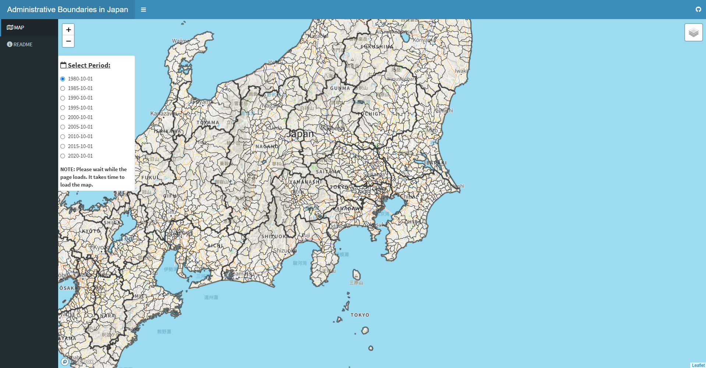

# Administrative Boundaries in Japan

## Shiny Web App

This web app visualizes historical administrative boundaries in Japan. Kondo (2019, 2021) provides the municipality converter.  
URL: https://keisuke-kondo.shinyapps.io/administrative-boundaries-japan/

### References
Kondo, K. (2019) Municipality-level panel data and municipal mergers in Japan, RIETI Technical Paper No.19-T-001 (in Japanese).  
URL: https://www.rieti.go.jp/en/publications/summary/23020001.html

Kondo, K. (2021) Municipality-level panel data and municipal mergers in Japan, RIETI Technical Paper No.23-T-001.  
URL: https://www.rieti.go.jp/en/publications/summary/23020001.html

## TERMS OF USE
Users (hereinafter referred to as the User or Users depending on context) of the content on this web site (hereinafter referred to as the Content) are required to conform to the terms of use described herein (hereinafter referred to as the Terms of Use). Furthermore, use of the Content constitutes agreement by the User with the Terms of Use. The content of the Terms of Use is subject to change without prior notice.

### Copyright
The copyright of the developed code belongs to Keisuke Kondo.

### Copyright of Third Parties
Keisuke Kondo developed the Content based on the National Land Numerical Information, which is provided from the Ministry of Land, Infrastructure, Transport and Tourism. Users must confirm the terms of use for the National Land Numerical Information, prior to using the Content.

### Disclaimer
<ul>
<li>Keisuke Kondo makes the utmost effort to maintain, but nevertheless does not guarantee, the accuracy, completeness, integrity, usability, and recency of the Content.</li>
<li>Keisuke Kondo and any organization to which Keisuke Kondo belongs hereby disclaim responsibility and liability for any loss or damage that may be incurred by Users as a result of using the Content. Keisuke Kondo and any organization to which Keisuke Kondo belongs are neither responsible nor liable for any loss or damage that a User of the Content may cause to any third party as a result of using the Content</li>
<li>Keisuke Kondo and any organization to which Keisuke Kondo belongs hereby disclaim responsibility and liability for any loss or damage that may be incurred by Users as a result of using the Content. Keisuke Kondo and any organization to which Keisuke Kondo belongs are neither responsible nor liable for any loss or damage that a User of the Content may cause to any third party as a result of using the Content</li>
</ul>

## Data Sources

### National Land Numerical Information: National Land Information Division, National Spatial Planning and Regional Policy Bureau, MLIT of Japan
URL: https://nlftp.mlit.go.jp/ksj/index.html  

### Municipal Name and Code：Portal Site of Official Statistics of Japan （e-Stat）
URL: https://www.e-stat.go.jp/

## Author
Keisuke Kondo  
Senior Fellow, Research Institute of Economy, Trade and Industry (RIETI)  
Associate Professor, Research Institute for Economics and Business Administration (RIEB), Kobe University  
URL: https://keisukekondokk.github.io/  

## Update History

Release Date: February 27, 2024  
